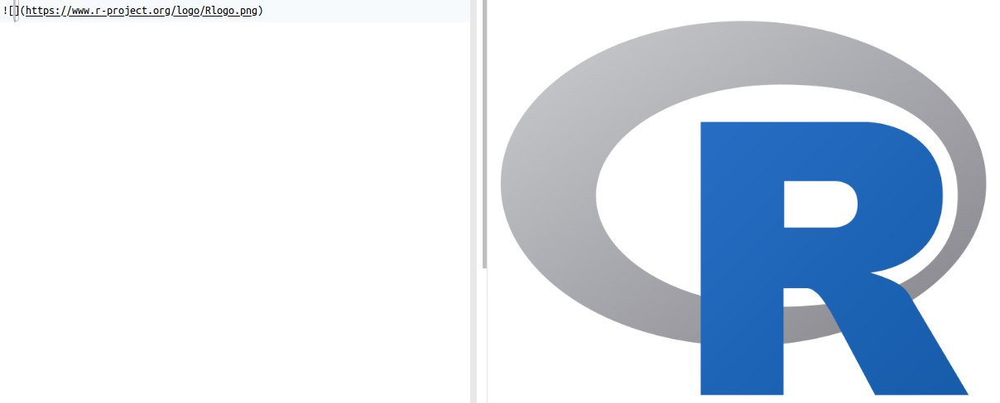

# La sintaxis Markdown

## 1. Acerca de Markdown
----------------------
[Markdown](https://daringfireball.net/projects/markdown/) es un [lenguaje de marcas](https://en.wikipedia.org/wiki/Markup_language) creado en 2004 por John Gruber. Las "marcas" se utilizan para brindar información acerca de la presentación (ej. negritas, itálicas) o la estructura (ej. títulos, encabezados) de un documento. Se caracteriza por ser más sencillo de leer y de usar que otros lenguajes de marcas (ej. [HTML](https://en.wikipedia.org/wiki/HTML)). Los documentos escritos en Markdown pueden exportarse a una gran variedad de formatos (ej. HTML, Doc, PDF, Latex) para ser usados en libros, presentaciones o páginas web, entre otros. Markdown es ampliamente utilizado en comunicación científica, documentación de programas e investigación reproducible.

## 2. Variaciones
----------------------
Las variaciones de Markdown, también llamadas _flavors_, son extensiones o modificaciones de la especificación original. Entre las más populares están:

- [R Markdown](): para el lenguaje R.
- [GitHub Flavored Markdown](https://help.github.com/en/github/writing-on-github): para el sitio GitHub.
- [Python Markdown](): para el lenguaje Python.
- [Pandoc's Markdown](): para el programa [Pandoc](https://pandoc.org/) de conversión entre formatos.
- [Kramdown](https://kramdown.gettalong.org/quickref.html): para el lenguaje Ruby.

Puede verse una lista más extensa en [https://github.com/commonmark/commonmark-spec/wiki/markdown-flavors](https://github.com/commonmark/commonmark-spec/wiki/markdown-flavors).

## 3. Sintaxis
----------------------
La sintaxis de Markdown permite especificar diferentes componentes de un documento, entre los que están:

- Encabezados.
- Estilos (ej. negritas, itálicas).
- Citas textuales.
- Enlaces a otros documentos (ej. páginas web).
- Imágenes.
- Listas.

### Encabezados
Pueden definirse seis niveles de encabezados, con los símbolos de numeral (#) antes del texto. El primer nivel es el más grande y el sexto el más pequeño. A la izquierda se muestra la sintaxis Markdown y a la derecha la forma en que se despliega en un documento.

### Sintaxis de Markdown - Itálicas
Se definen con un asterisco (*) antes y después del texto o con un guión bajo (_) antes y después del texto.

### Sintaxis de Markdown - Negritas
Se definen con dos asteriscos (**) antes y después del texto o con dos guiones bajos (__) antes y después del texto.

### Sintaxis de Markdown - Citas textuales
Se definen con un símbolo de "mayor que" (>) antes de cada línea.

### Sintaxis de Markdown - Enlaces a otros documentos
Se definen con un paréntesis cuadrados[] seguidos de paréntesis redondos (). En los paréntesis cuadrados se coloca (opcionalmente) el texto del enlace y en los redondos la dirección del documento.

### Sintaxis de Markdown - Imágenes
Se definen con un signo de admiración de cierre (!), paréntesis cuadrados[] y paréntesis redondos (). En los paréntesis cuadrados se coloca (opcionalmente) un texto para la imagen y en los redondos la dirección de la imagen, ya sea en el disco o en la red.

### Sintaxis de Markdown - Listas numeradas
Se definen con números antes de cada elemento.

## Sintaxis de Markdown - Listas no numeradas
Se definen con guiones antes de cada elemento.

### Otros elementos de sintaxis
Para conocer otros elementos de la sintaxis de Markdown, se recomienda revisar en detalle:

- Guía de referencia de Markdown: [Markdown Guide](https://www.markdownguide.org/)
- Tutorial sobre Markdown: [Markdown Tutorial](https://www.markdowntutorial.com/)

## 4. Recursos
----------------------
- Sitio oficial de Markdown: [Daring Fireball: Markdown](https://daringfireball.net/projects/markdown/)
- Página en Wikipedia sobre Markdown: [Markdown - Wikipedia](https://en.wikipedia.org/wiki/Markdown)
- Guía de referencia de Markdown: [Markdown Guide](https://www.markdownguide.org/)
- Ficha de ayuda de GitHub Markdown: [Markdown Cheatsheet](https://github.com/adam-p/markdown-here/wiki/Markdown-Cheatsheet)
- Tutorial sobre Markdown: [Markdown Tutorial](https://www.markdowntutorial.com/)
